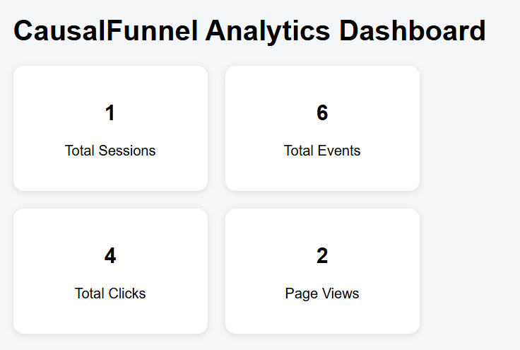
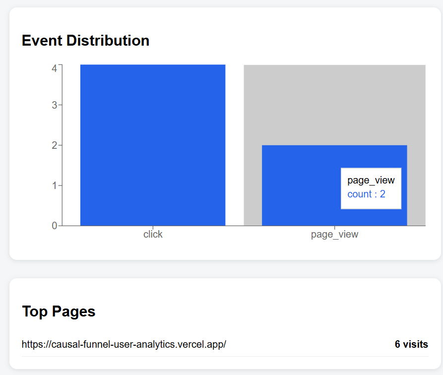
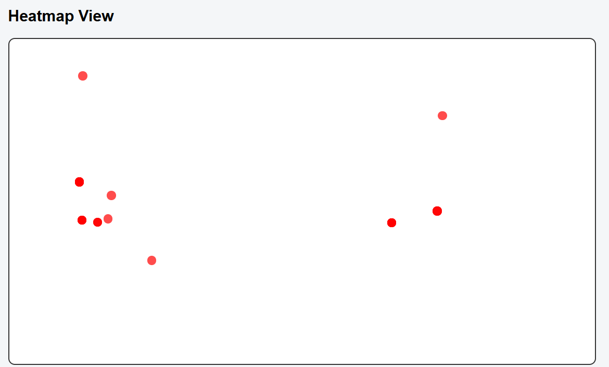

# CausalFunnel User Analytics Dashboard

## Live Demo

Frontend:
https://causal-funnel-user-analytics.vercel.app/

Backend API:
https://causalfunnel-backend-gnani.onrender.com/

---

## Overview

CausalFunnel User Analytics Dashboard is a full-stack analytics platform that tracks user interactions on a website and visualizes behavioral insights through an interactive dashboard.

The application captures events such as page views and clicks, stores them in MongoDB Atlas, and provides analytics including session tracking, event distribution, user journey visualization, top visited pages, and click heatmaps.

---

## Features

### Event Tracking
- Track page views
- Track click events
- Store user interaction data in MongoDB Atlas

### Analytics Dashboard
- Total Sessions
- Total Events
- Total Clicks
- Total Page Views

### User Journey Analysis
- Session-wise event history
- Chronological user activity timeline
- Session search functionality

### Visualization
- Event distribution charts
- Click heatmap visualization
- Top visited pages analytics

### Deployment
- Frontend deployed on Vercel
- Backend deployed on Render
- Database hosted on MongoDB Atlas

---

## Tech Stack

### Frontend
- React.js
- Axios
- Recharts

### Backend
- Node.js
- Express.js

### Database
- MongoDB Atlas
- Mongoose

### Deployment
- Vercel
- Render

---

## Architecture

User Browser
↓
React Frontend
↓
Express Backend API
↓
MongoDB Atlas Database

---

## API Endpoints

| Method | Endpoint | Description |
|----------|----------|----------|
| POST | /api/events | Save event |
| GET | /api/sessions | Get all sessions |
| GET | /api/session/:id | Get session events |
| GET | /api/heatmap | Get click heatmap data |
| GET | /api/stats | Dashboard statistics |
| GET | /api/event-distribution | Event distribution |
| GET | /api/top-pages | Most visited pages |

---

## Dashboard Analytics

The dashboard provides:

- Session Analytics
- Event Distribution Analysis
- User Journey Tracking
- Click Heatmap Visualization
- Top Pages Analysis
- Real-time Interaction Monitoring

---

## Future Improvements

- Real-time analytics using WebSockets
- Conversion funnel analysis
- Device and browser analytics
- User retention tracking
- Geographic analytics
- Advanced dashboard filters

---
## Dashboard Preview

### Dashboard Overview

### Analytics Overview

### Session Analytics & User Journey

.png)

### Heatmap Visualization

## Author

Gnani Prakash Yaddanapudi

Indian Institute of Technology Jodhpur

Computer Science & Engineering
